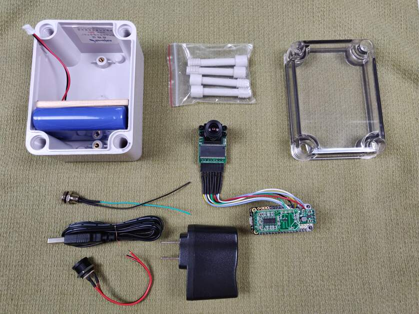
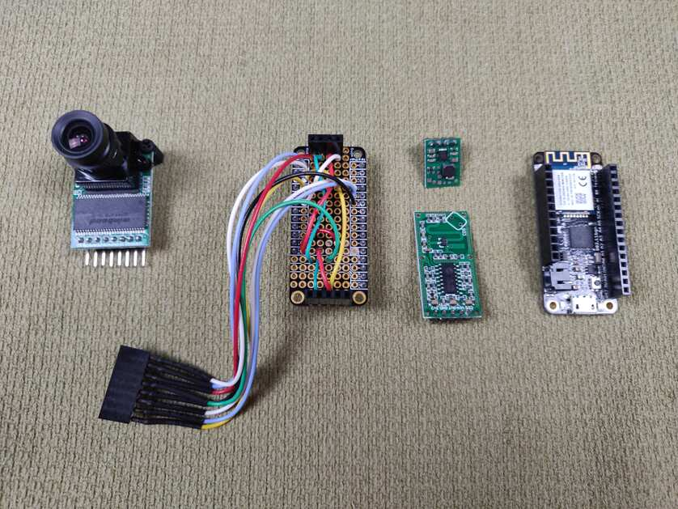
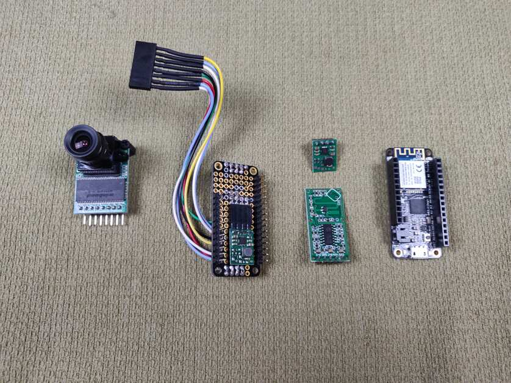
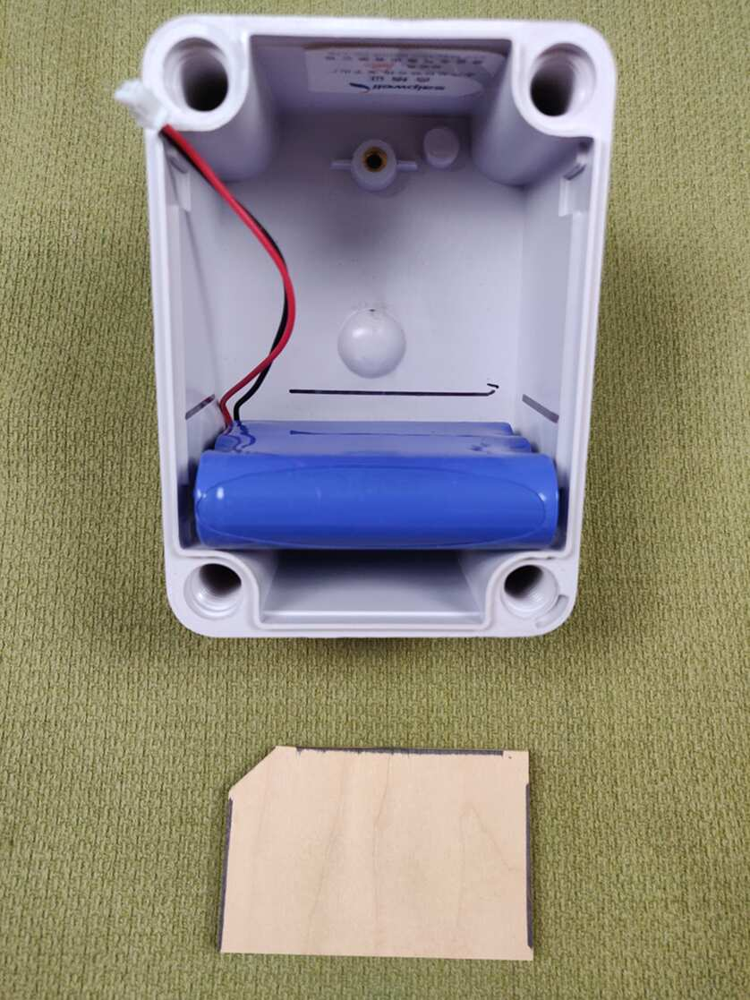
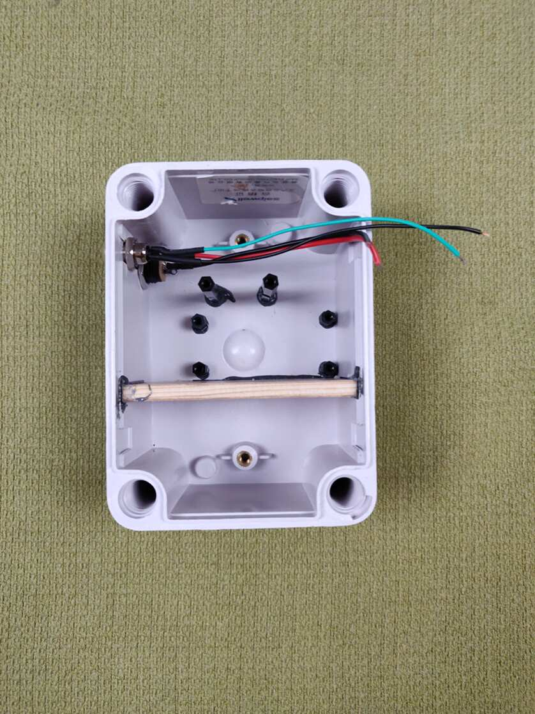
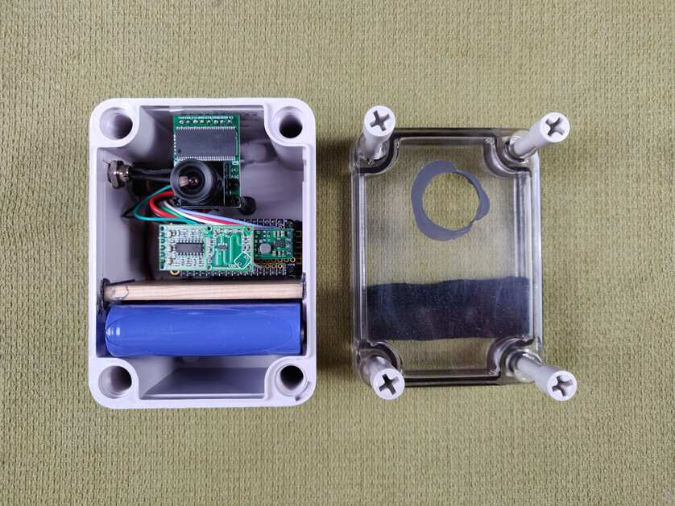
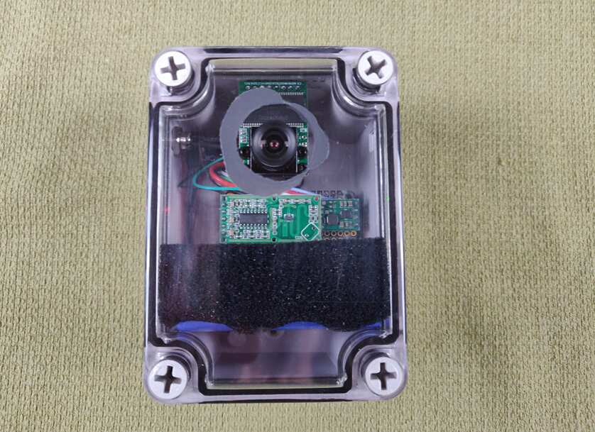
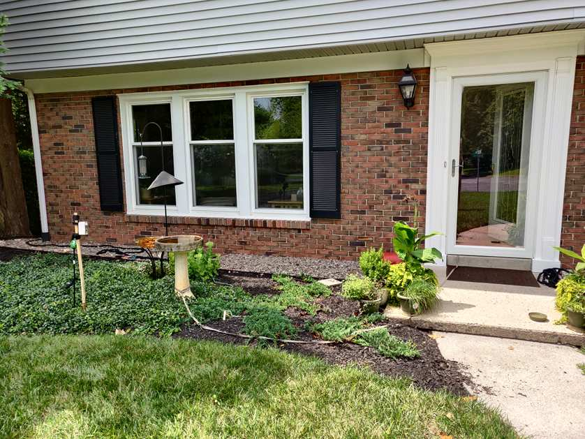

How to Build a Water-Resistant, Battery-Operated, Low-Power, Motion-Activated, 5 Mega-Pixel WiFi Camera
--------------------------------------------------------------------------------------------------
This project shows you how to build a WiFi camera that sleeps until activated by a microwave motion sensor. It carefully
conserves power to maximize battery life. (You can expect to get one or two weeks of use from the battery.) The camera 
takes great color pictures and movies in a range of sizes from 320x240px to 2592x1944px. The camera's [Adafruit 
Feather M0](https://www.adafruit.com/product/3010) sends the pictures to a 
[CGI](https://en.wikipedia.org/wiki/Common_Gateway_Interface) for image processing and storage. (See the 
[JPEG Catcher project for further details](https://github.com/patrickmoffitt/jpeg_catcher).) There is no SD 
card in this project. The images are stored "in-your-cloud" where the CGI is hosted. This project teaches you how to 
move relatively large hunks of data like the camera's 8MB image buffer in small hunks like the WINC1500's 1400 byte 
[MTU](https://en.wikipedia.org/wiki/Maximum_transmission_unit) over WiFi to a server. It does this using the old-school 
method of [base64 encoding](https://en.wikipedia.org/wiki/Base64) the binary image data. This makes the data into a 
stream of visible characters that get piped into the CGI on standard input. That stream looks like this JSON object:
```json

[{"name": "battery_percent", "value": "99"},{"name": "json_file", "content_type": "image/jpeg", "value": ""}]

```
with the empty value of "value" replaced with the Base64 encoded image data. The CGI decodes the data back into binary 
format and saves it to storage. From there a web server makes the images browsable. See the 
[JPEG Catcher Project](https://github.com/patrickmoffitt/jpeg_catcher) for details. The camera has a wide assortment of 
settings that control all aspects of picture taking. The [Camera Settings Project](https://github.com/patrickmoffitt/camera_settings) 
provides a mobile-responsive web page for adjusting those settings. This means you won't have to compile a new binary 
and load it into the Feather just to adjust the camera's exposure, brightness, or contrast, et cetera. The settings are 
passed from the web page to a web socket server in the form of 
[Google flatBuffers](https://google.github.io/flatbuffers/index.html). This is the 
new-school way to move relatively-small, fixed length, data structures around the web *in binary format*. The 
flatBuffers project provides libraries in many languages so that it's easy to go from JavaScript to C++ and back. This 
project includes both old and new school data communication methods for at least two reasons;
- There is still a whole lot of legacy code in use and not every robotics/embedded project starts from scratch. Often
new technology must be integrated with old technology; CAN bus, MQTT, and Base64 are just a few examples.
- The Internet of Things needs very efficient, low-power, machine-to-machine communication and projects like flatBuffers
are a good solution. The need is so ubiquitous it's essential that everyone in the robotics/embedded space is familiar
with such solutions.

Schematic
---------

- [Eechema Schematic PDF](images/5MP_Motion_Camera_v1_2.pdf)
- [Eechema Schematic](images/5MP_Motion_Camera_v1_2.sch)

Building
--------
I used [platformio](https://platformio.org/) to build this project. If you plan to do the same you'll need to create a 
platformio.ini file. It should look something like the one below. Replace the items in all-caps with your own
configuration.
```ini

[common]
lib_deps_external =
    https://github.com/arduino-libraries/WiFi101.git

[env:adafruit_feather_m0]
platform = atmelsam
board= adafruit_feather_m0
framework = arduino
upload_port = /dev/YOUR_TTY_DEVICE
upload_speed = 115200
lib_deps = ${common.lib_deps_external}
build_flags =
    '-DWIFI_SSID="YOUR WIFI ACCESS POINT SSID"'
    '-DWIFI_PASS="YOUR WIFI PASSWORD"'
    '-DHTTP_HOST="IP ADDRESS OF YOUR CGI/WEBSOCKET SERVER"'
    '-DHTTP_HOST_PORT=4444'
    '-DSOCKET_PORT=8880'
    '-DHTTP_HOST_URL="/cgi-bin/jpeg_catcher"'
    '-std=c++14'
    '-std=gnu++14'
build_unflags =
    '-std=gnu++11'
```

Materials List
--------------
- [Adafruit Feather M0 WiFi - ATSAMD21 + ATWINC1500](https://www.adafruit.com/product/3010)
- [FeatherWing Proto - Prototyping Add-on For All Feather Boards](https://www.adafruit.com/product/2884)
- [Stacking Headers for Feather - 12-pin and 16-pin female headers](https://www.adafruit.com/product/2830)
- [Lithium Ion Battery Pack - 3.7V 6600mAh](https://www.adafruit.com/product/353)
- [Uxcell 80mm x 110mm x 70mm ABS Junction Box with PC Transparent Cover](https://www.amazon.com/gp/product/B0723DW5TT)
- [8mm Mini 1NO 2Pin Metal Momentary Push Button Switch](https://www.amazon.com/gp/product/B077VPPFCX)
- [Panel Mount 2.1mm DC barrel jack](https://www.adafruit.com/product/610)
- [USB to 2.1mm Male Barrel Jack Cable](https://www.adafruit.com/product/2697)
- [Pololu 5V Step-Up Voltage Regulator U1V11F5](https://www.pololu.com/product/2562)
- [Arducam Mini Module Camera Shield 5MP Plus OV5642 Camera Module](https://www.amazon.com/gp/product/B013JUKZ48)
- [RCWL-0516 Motion Detection Sensor](https://www.amazon.com/gp/product/B07GCHY9K6)
- [Optional - Fused Silica Optical Glass Disk 1 in. X 0.125 in](https://www.amazon.com/gp/product/B07Q5B9ZTQ)

Notes on Construction
---------------------
- I replaced the stock 90 degree headers on the camera with straight headers to better suit my enclosure. Since I have a 
de-soldering gun this was relatively easy for me to do.
- In the past I've gotten junction boxes with transparent covers that are very clear and see-through. That wasn't the 
case this time so I installed the (optional) glass disk as a porthole for the camera to see through. 

Images
------

















Credits
-------
- Thank you to [wblommaert](https://github.com/wblommaert) for his Arduino Websocket Client. 
- Thank you to [Marty Stepp](https://www.martystepp.com/) for his base 64 encoding and decoding library. 
- Thank you to the [FlatBuffers contributors](https://github.com/google/flatbuffers/graphs/contributors) for the 
[Google FlatBuffers](https://github.com/google/flatbuffers) project.

Bugs, Issues, and Pull Requests
------------------------------
If you find a bug please create an issue. If you'd like to contribute please send a pull request.

References
----------
The following were helpful references in the development of this project.
- ArduCAM
    - [Arducam Shield Mini 5MP Plus](https://www.arducam.com/docs/spi-cameras-for-arduino/hardware/arducam-shield-mini-5mp-plus/)
    - [Arducam Chip - Technical Specifications](https://www.arducam.com/docs/spi-cameras-for-arduino/hardware/arducam-chip/)
    - [ArduCAM Mini 5MP OV5640 Plus Examples](https://github.com/ArduCAM/Arduino/tree/6b65ff4f6259374558b76005c0fbc8c3a0681aef/ArduCAM/examples/mini)
- WebSockets
    - [A brief overview of the websocket protocol](https://noio-ws.readthedocs.io/en/latest/overview_of_websockets.html)
    - [Arduino Websocket Client](https://github.com/wblommaert/arduino-websocket-client)
- RCWL-0516 Microwave Motion Sensor
    - [RCWL-0516 microwave motion sensor](https://github.com/jdesbonnet/RCWL-0516)